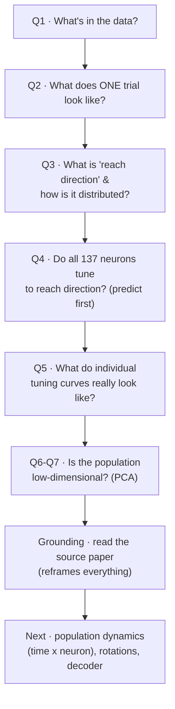
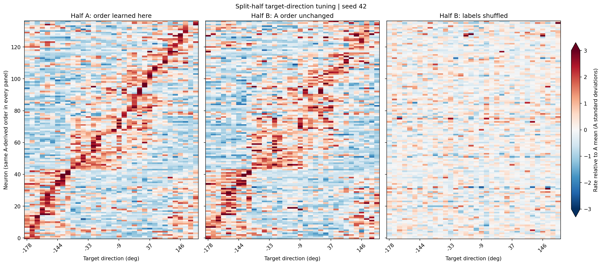
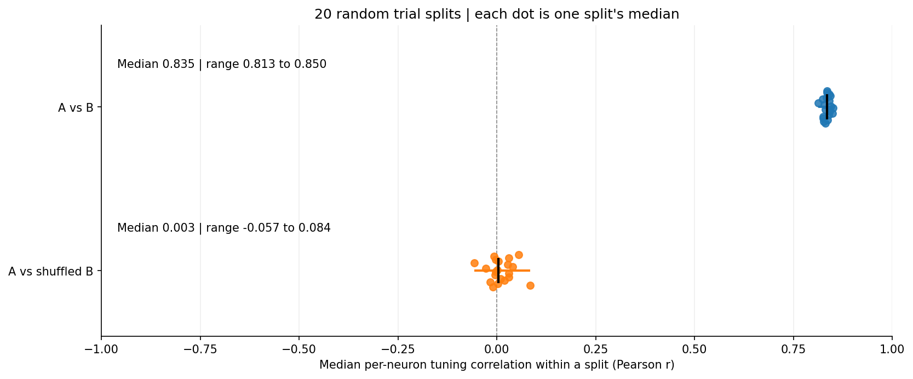
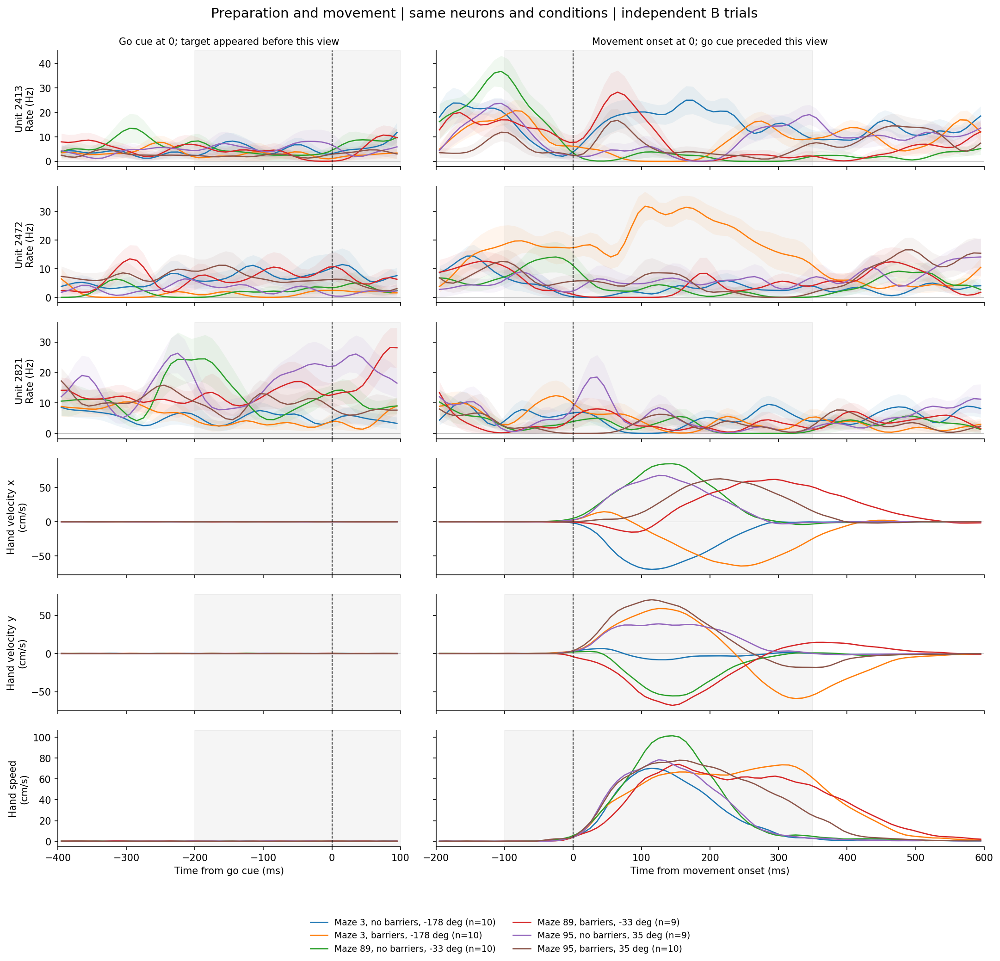
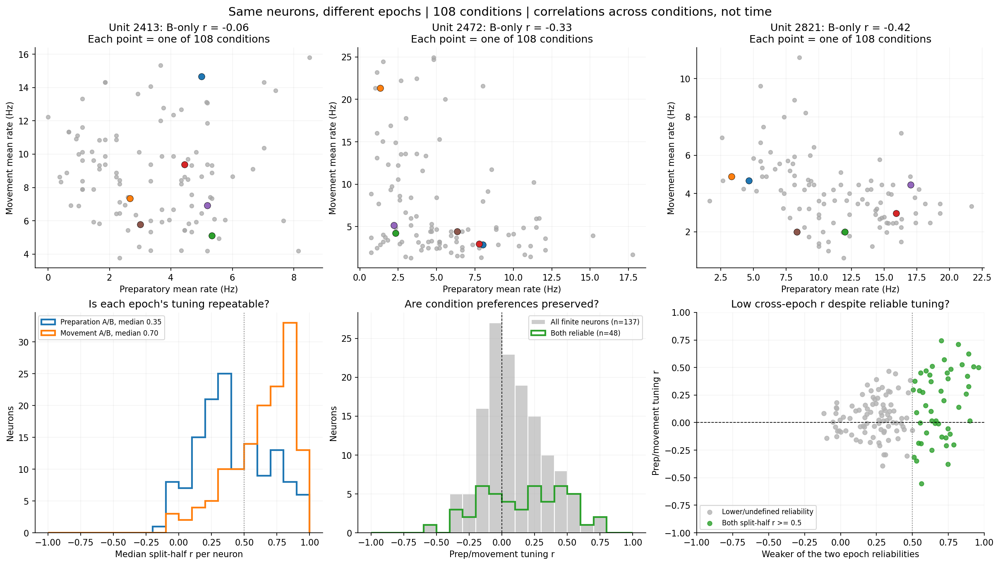
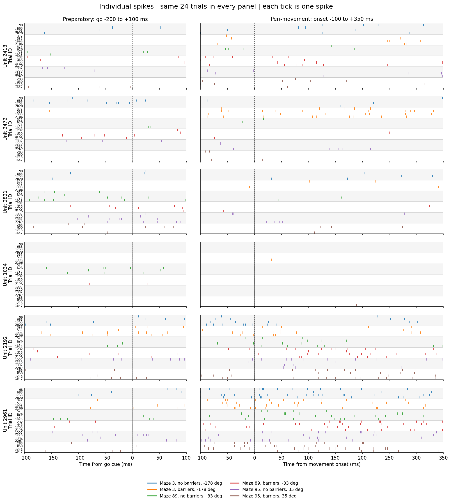
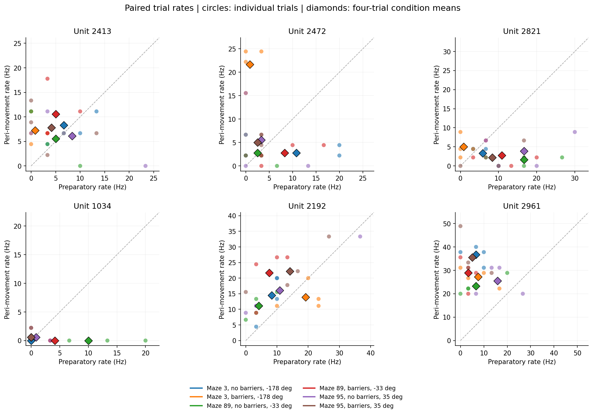
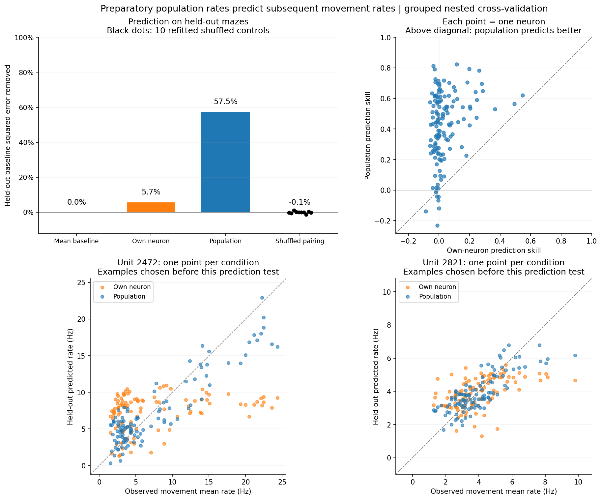

# MC_Maze Directional Tuning — Experiment Log

*Project: `motor-cortex-population-dynamics` (Season-2 capstone). Written 2026‑07‑17.*
*Repo: https://github.com/prateekkarkare/motor-cortex-population-dynamics · Notebook: `notebooks/01_load_and_explore.ipynb`*

> **Correction, 2026-09-13:** the original binning assigned nonchronological spike
> rows to a replacement clock. The historical tuning/PCA results and biological
> explanations below are not reliable evidence until rerun. The corrected
> split-half experiment gives median A/B tuning correlation **0.830**. See the
> appended [split-half correction](#2026-09-13-split-half-heatmap-and-timing-correction)
> for the independent raw-count check, repair, and interpretation.

> **What this is.** A start‑to‑finish log of the first sitting on the MC_Maze
> reaching dataset: every question we asked, *why* we asked it, what the data
> answered, and what it taught us — including which predictions held and which
> surprised us. Written so it still makes sense a year from now.

---

## TL;DR (for future‑me, 30 seconds)

- **Goal:** learn how motor cortex (M1/PMd) encodes *reach direction*, as the first
  rung toward population dimensionality‑reduction (PCA) and a reach‑direction
  **decoder**.
- **Data:** MC_Maze (Churchland & Shenoy *maze* reaches; DANDI `000128`). 137
  held‑in neurons, 2,295 trials, 1 ms spikes + hand/cursor/eye kinematics.
- **Headline finding:** neurons *are* cosine‑tuned to reach direction — **but only
  weakly** when direction is defined by the **target** (best neuron R² ≈ 0.37, most
  ≈ 0.2, vs. 0.5–0.8 in classic center‑out). 
- **Why (hypothesis):** this is a **maze** — reaches curve around barriers, so the
  *target* angle is a poor stand‑in for the *movement* the hand actually made.
- **Two craft lessons that bit us:** (1) a preferred‑direction–**sorted heatmap
  always looks diagonal**, even for noise; (2) selecting "tuned" neurons by
  **max−min rate** picks noisy high‑rate cells, not tuned ones — select by fit R².
- **The reframe (after reading the source paper):** single-neuron cosine tuning is
  *supposed* to be weak here — Churchland et al. (2010) show M1/PMd responses are
  complex/multiphasic and the real structure is **population-level dynamics**, not
  single-neuron tuning. The 2-D "ring" lives in the **time-evolving population
  trajectory (rotations)**, not the static tuning matrix. We independently walked
  into the field's tuning -> dynamics shift.
- **Next:** pivot to the **time x neuron population trajectory** — PCA the
  time-resolved state and look for **rotational (jPCA)** structure; then a decoder.

---

## 0. Setup — what we were trying to do and with what

The capstone question is a classic one from systems neuroscience: **when a monkey
reaches in a direction, how does the population of motor‑cortex neurons represent
that direction?** We chose MC_Maze because it is a large, well‑curated reaching
dataset (via the Neural Latents Benchmark) with simultaneously recorded spikes and
hand kinematics.

The raw file is one NWB (`sub‑Jenkins…train…nwb`, ~690 MB), loaded with `nlb_tools`
`NWBDataset`, which turns it into two objects: a continuous 1 ms time series
(`.data`: spikes + kinematics) and a per‑trial table (`.trial_info`: targets,
events, success). *(Environment gotchas that cost real time are in the appendix.)*

---

## The investigation, question by question

### Q1 — What is actually in this data? *(before touching any analysis)*

**Why we asked.** You can't interpret a tuning curve if you don't know what a
"trial", a "neuron", or a "direction" *is* in the file. First, orient.

**What we found.**
- `.data` at **1 ms**: `spikes` (**137 held‑in neurons**), `heldout_spikes` (45),
  plus `hand_pos`, `hand_vel`, `cursor_pos`, `eye_pos` (each x/y).
- `.trial_info`: **2,295 trials**, each with up to 3 on‑screen targets
  (`target_pos`), an `active_target` index (the one actually reached), barriers,
  and event times (`target_on`, `go_cue`, `move_onset`).

**What it taught us.**
- **Held‑out neurons** aren't a different signal — they're a *train/test split
  across neurons* for the benchmark's "co‑smoothing" task (predict the hidden
  neurons from the visible ones). We ignore them and use the 137 held‑in.
- **Binning spikes** (we used 20 ms) is just the crudest firing‑*rate* estimate:
  spike train → counts/window → Hz. Small bins = noisy/quantised; big bins =
  smooth but blurry. It's a bias–variance knob.

### Q2 — What does a single trial look like? *(raw‑data sanity check)*

**Why we asked.** Before averaging over thousands of trials, *look* at one, so any
later summary can't hide a bug or a misunderstanding.

We built a stacked, shared‑time overview — spikes, per‑neuron rates, and all
kinematics on one clock — and a 2‑D workspace view of the same trial.

**What we saw.** A textbook **delayed reach**: the hand holds still through
`target_on` → `go_cue`, then fires a single clean velocity burst ~100 ms after
`move_onset`; the cursor **curves between the barriers** to the target; the eye
saccades toward the target region around the movement.

**What it taught us (a pile of small, important truths).**
- **Coordinate frames differ.** `cursor_pos` shares the *screen* frame with the
  targets (starts at center, travels to the target). `hand_pos` is the *physical*
  manipulandum, shifted ~25 units in y. `eye_pos` roams much wider (saccades). →
  "reach direction from the hand" and "…from the target" are not trivially the
  same thing (foreshadowing Q5).
- **It is genuinely a maze:** the reach *path* is curved even when the *endpoint*
  direction is simple.
- **Derivatives amplify noise.** Eye *velocity* isn't stored; differentiating raw
  1 ms eye position is almost pure noise — we had to smooth (~20 ms) first for
  saccades to show as clean spikes. (Same reason `hand_vel` is provided
  pre‑computed.)
- **Single‑trial per‑neuron rate is quantised** (one spike in a 20 ms bin = 50 Hz),
  so a single‑trial rate "heatmap" is basically a coarse raster — you need trial
  averaging (Q4) to see smooth rates.

### Q3 — What *is* reach direction, and how is it distributed? *(defining the label)*

**Why we asked.** Directional tuning needs a direction *label* per trial. We had to
pin down its definition and reference frame, then see how the dataset samples it.

**Definition we used.** The angle of the active target from the center hold,
`θ = atan2(y_target, x_target)` in degrees (0° = +x/right, CCW positive). Because
reaches start at ~center, the target's position vector ≈ the reach vector.

**A conceptual point we surfaced.** Reach direction is *really a time series* — at
each instant the hand has a velocity vector with its own heading `θ(t) =
atan2(v_y, v_x)`. The single per‑trial angle is a **summary** of that. For a
straight reach the summary is faithful; for a **curved maze reach it is lossy**
(again foreshadowing Q5).

**What we found.** Reach direction here is **discrete**: only **~35 unique target
positions / 34 unique angles** across 2,295 trials — and the sampling is
**non‑uniform**, with genuine **gaps** (e.g. nothing at ~−90° straight down). But
every direction that *exists* is **well sampled** (52–129 trials each, median 63).

**What it taught us.** Treat direction as a **categorical variable with ~34
levels**, not a continuous sweep. The gaps aren't under‑sampling — they mean *no
target exists at that angle*. Good statistics per direction; uneven angular
coverage; not a clean 8‑way center‑out.

### Q4 — Do the 137 neurons tune to reach direction? *(prediction first!)*

**Why we asked.** This is the capstone's core question, and the point where the
learning value is in **predicting before looking**.

> **Prediction (written before the plot):** a **cosine / Gaussian bump** peaking at
> each neuron's preferred direction; **most** of the 137 tuned, with a few flat;
> preferred directions **non‑uniform**. *Motivation: characterise each neuron by
> direction so similar neurons can be grouped.*

We averaged each neuron's firing rate (in a −100…+400 ms peri‑movement window) over
trials at each of the 34 directions → a **34 × 137** tuning matrix, then drew it as
a heatmap: each neuron **z‑scored** across directions (so tuning *shape* shows
regardless of baseline rate), neurons **sorted by preferred direction**.

**What it looked like.** A gorgeous, clean **diagonal band** — every direction is
some neuron's favourite, with a dark anti‑preferred trough ~180° opposite. It looks
like a poster‑perfect population code.

**The caveat we immediately flagged (and it mattered).** *Sorting neurons by their
argmax preferred direction produces a diagonal even from pure noise.* The diagonal
alone proves nothing; only the **contrast** of the band and the anti‑preferred
trough hint at real tuning. To actually trust it, look at raw single‑neuron curves
— Q5.

### Q5 — What do individual tuning curves really look like? *(and the twist)*

**Why we asked.** To check whether the beautiful heatmap was real tuning or a
sorting artifact, and to finally *see* the predicted cosine bump in raw Hz.

**First attempt — and a self‑inflicted lesson.** We first picked "tuned" neurons by
**modulation depth** (max − min rate). The curves came out **flat / noise‑cloud**,
cosine R² ≈ **0.01–0.08**:

→ **Lesson:** max−min depth just favours **high‑rate, noisy** neurons, not *tuned*
ones. A big spread of rates ≠ directional tuning. Select by the **cosine fit R²**
instead.

**Second attempt — select the best cosine fits.** Now the bumps appear, but they're
**modest**: best neuron **R² ≈ 0.37**, most ≈ **0.2**; preferred directions differ
across neurons (e.g. neuron 2232 peaks ~+87°, neuron 2381 ~−110°).

**The surprise.** The population heatmap *looked* like crisp tuning, but individual
neurons are only **weakly** cosine‑tuned **to the target direction** — much weaker
than the textbook center‑out result. The heatmap oversold it (the sort), exactly as
the Q4 caveat warned.

**Why (leading hypothesis).** The **maze**. Because reaches curve around barriers,
trials sent to the "same" target angle involve **different actual movements**;
averaging them blurs the cosine. Motor cortex is thought to encode the **movement**
(hand velocity), not the abstract goal — so *target* angle is the wrong label. This
is the very target‑vs‑movement distinction we noticed back in Q2/Q3.

### Q6-Q7 — Is the population low-dimensional? *(PCA)*

**Why we asked.** If 137 neurons are really reading out a few latent signals, PCA
should show it. Pure cosine tuning predicts the *direction* signal is **2-D** (the
cos/sin of the angle), so the 34 conditions in PC1-PC2 should trace a **ring**.

**What we found (surprise).** They didn't. PCA of the trial-averaged 34x137 tuning
matrix took **~17 PCs to reach 85%** (PC1 22%, PC2 10%); PC1-PC2 was a **scrambled
blob, not a ring**, and PC1/PC2 vs angle were jagged, not cos/sin. Robustness checks:
- **z-scoring** each neuron (equal vote) made it *worse* (85% at ~21 PCs) -> the
  high dimensionality is real, not a loud-neuron artifact.
- **straight reaches only** (tortuosity <= 1.18) stayed high-D, but with only 3-11
  trials/direction -> noise-dominated and inconclusive.

**Lesson (craft).** Removing the maze confound by *subsetting* traded bias for
variance (too few trials -> noise). Better to relabel/model than subset. (Full PCA
in notebook section 7.)

---

## Predictions vs. outcomes

| # | Prediction (before plotting) | Outcome | Verdict |
|---|------------------------------|---------|---------|
| 1 | Firing rate vs direction = **cosine/Gaussian bump** at a preferred direction | True in shape — best fits are clearly cosine — but **weak** (R² ≈ 0.2–0.37) to *target* direction | **Met, with an asterisk** |
| 2 | **Most** of 137 tuned; a few flat | Best cells clearly tuned; *many* are weak/noisy **to target direction** — more "flat" than expected | **Partly met** |
| 3 | Preferred directions **non‑uniform** | Not yet tested — the sorted heatmap can't show it; needs a preferred‑direction histogram | **Open** |
| — | *(surprise)* Heatmap looked cleanly tuned | Single‑neuron tuning to target direction is modest; the diagonal was partly a **sorting artifact** | **Unexpected** |

---

## What we learned

**Neuroscience / data.**
- M1/PMd neurons carry a **cosine directional signal**, but its strength depends
  entirely on *how you define direction*. In a maze, **target ≠ movement**, and
  tuning to the target is weak.
- Reach direction is fundamentally a **velocity time series**; a per‑trial scalar is
  a lossy summary that's fine for straight reaches and poor for curved ones.

**Method / craft (the transferable stuff).**
- **Predict before you plot.** The value was in calling the cosine shape *first*,
  then being genuinely surprised by its weakness.
- **A sorted heatmap always looks structured.** Sorting by argmax manufactures a
  diagonal from noise; trust **contrast + independent raw curves**, not the sort.
- **Choose selection metrics that match the question.** "Most variable" (max−min) is
  not "most tuned" (fit R²). The wrong metric nearly hid the real result.
- **z‑scoring** reveals *shape* by removing baseline and depth — great for comparing
  tuning across neurons, but it *hides* absolute rate and tuning *strength*; always
  cross‑check with raw units.
- **Look at one trial before averaging thousands.** Half our "gotchas" (frames,
  barrier encoding, eye‑velocity noise, rate quantisation) came from Q2.

---

## Grounding (the step we should have taken first): the source paper

After all of the above we stepped back and read the paper behind the data —
**Churchland, Cunningham, Kaufman, Ryu & Shenoy (2010), "Cortical preparatory
activity: representation of movement or first cog in a dynamical machine?"**,
*Neuron* 68(3):387-400 (PMC2991102). It reframes everything.

### What the experiment actually is
- **Task:** a **delayed reach**. The monkey holds a central spot; a **target**
  appears; after a variable **delay** a **go cue** is given; then it reaches. Only
  delays > 400 ms are analysed. Reaches last ~200-600 ms.
- **Ours is the "maze task," monkey J (Jenkins)** — hence `sub-Jenkins`. Central
  start -> **one** target + **virtual barriers**; the reach is **straight** (no
  barrier) or must **curve** around barriers. Some conditions add **distractor**
  targets.
- **Recordings — our exact dataset is the "monkey J-array" set:** a pair of
  implanted **96-electrode arrays** in **caudal PMd + surface/sulcal M1** (so our
  137 units are a **mix of M1 and PMd**), **~2,155 trials/neuron**, **~108
  conditions**.
- **Why so many weak neurons:** arrays record **unbiased** (often multi-unit, lower
  modulation) — unlike hand-placed single electrodes that *select* strongly-tuned
  cells. The messy, weakly-tuned population we saw is the honest one.
- **Conditions vs directions:** ~108 conditions but only ~35 target locations, so the
  **same direction is reached by several different movements** (straight vs curved).
  The target-vs-movement decoupling we kept hitting is **designed into the task.**

### Our "failures" are the paper's headline findings
| What we found | What the paper reports |
|---|---|
| Cosine tuning weak (R^2 ~ 0.2-0.37) | Single-neuron responses **"complex and multiphasic," "not easily explained by a pure directional preference"** — even for straight reaches |
| PCA needs ~17-21 dims (no 2-D ring) | Population is high-D: preparation **"at least 7-10 dimensions,"** movement PCA uses **k = 3-14** |
| Straight-reach subset didn't rescue a ring | Complexity is present **even for simple center-out reaches** — subsetting was never going to give a ring |
| Direction wasn't the dominant PC | No task variable (endpoint/velocity/direction/...) beat the **population's own activity space**; *"underscores our ignorance regarding the true factors"* |

We independently walked into the exact wall that pushed the field from **tuning
curves -> population dynamics**.

### Where the 2-D "ring" actually lives
The cosine -> 2-D intuition was **right about the wrong object.** In the paper's
harmonic-oscillator model (their Fig. 8), the **population** traces **rotations**
through state space **over time**; a single neuron then looks like a messy cos/sin
mixture only weakly tied to preparation. The 2-D structure is **rotational dynamics
of the population trajectory in time** — not a static tuning curve. We were PCA-ing
the **static condition x neuron** matrix; the structure is in the **time x neuron
trajectory.**

---

## Appendix — environment & reproducibility (the plumbing)

Real time went into making `nlb_tools` run on a modern Mac; recording so it never
bites again:

- **`nlb_tools` pins `pandas <= 1.3.4`**, which has *no* Apple‑Silicon wheel → pip
  tries to build it from source and fails. Fix: **Python 3.9** venv + **`pandas
  1.5.3`** + install `nlb_tools` with `--no-deps`.
- On pandas ≥ 1.5, `nlb_tools`' `resample()` and `make_trial_data()` break (strict
  index‑frequency validation). Fix: after binning, **rebuild a clean regular
  `TimedeltaIndex`** (`bin_spikes` does this).
- **Slicing a trial** with `.loc[start:end]` on the native 1 ms index silently
  returns the *whole* session → use a boolean time **mask** (`trial_window`).
- **`dandi` CLI is version‑blocked** (server needs ≥ 0.74, which dropped Py3.9) →
  download the two NWB assets **directly from the DANDI API** with `curl`.
- Data is git‑ignored (~690 MB); see the repo README for the exact download step.

---

## Next steps

The reframe changes the plan: stop chasing single-neuron *direction tuning* (the
source paper shows it's the wrong frame here) and move to **population dynamics**.

1. **Time x neuron population trajectory.** Build trial-averaged PSTHs per condition,
   stack into a (time x neuron) matrix, PCA it, and plot the **state-space
   trajectory** aligned to movement onset. This is the object the paper analyses.
2. **Look for rotational structure (jPCA).** The 2-D cos/sin we expected should show
   up as **rotations** of the population state over time, not a static ring
   (Churchland et al. 2012 Nature, *Neural population dynamics during reaching*).
3. **Condition-independent signal first.** Expect PC1 to be the big shared
   movement-onset ramp (not direction) — separate it out before reading direction.
4. **Only then a decoder:** reconstruct hand velocity `v(t)` from the low-D
   population state over time (the season goal).

Older threads still worth a look, but secondary: hand-velocity-based direction
labels, a preferred-direction histogram, and clustering neurons by tuning.

*— end of log —*

---

## 2026-09-13 Split-half heatmap and timing correction

### Question and prediction

Does the preferred-direction diagonal reproduce on independent trials, or is it
only a consequence of sorting observed maxima? Prateek predicted, before seeing
the real split, that B's diagonal would be as strong as A's because neurons have
preferred directions. A and B contain different trials of the same neurons.

### Method

Use mean rates from complete -100 to +400 ms movement-aligned windows. Split
whole trials randomly within target direction (seed 42), estimate empirical
preferred directions from A, and display B without re-sorting. Use A's per-neuron
mean and standard deviation and one fixed color scale for all panels. A third
panel permutes B's trial labels, preserving direction counts and whole population
response vectors. This is one illustrative shuffle, not a significance test.

### A preprocessing bug, not a negative neuroscience result

The first attempt gave median A/B correlation 0.017 and an almost absent B ridge.
An independent count check failed: raw NWB spike timestamps disagreed with the
notebook's rates for 9 of 25 sampled trial/neuron pairs. The discrepancy already
existed in the continuous binned data, before trial splitting.

The native loader returned a nonchronological time index. Its resampler groups
consecutive rows, so binning before sorting and then rebuilding a regular clock
assigned counts to incorrect times. The repaired `bin_spikes` sorts native
timestamps first, requires a unique regular clock, and refuses to replace
mismatched timestamps. The raw dataset was reloaded before repeating the split.

The earlier workaround in the historical environment appendix is therefore
insufficient. Earlier weak cosine fits, 17-21-PC counts, and maze-based
explanations are withdrawn pending recomputation; those analyses were not rerun
in this session. Their original records and plots are retained as history.

### Corrected result

All 2,295 trials now have complete windows, restoring the 47 previously dropped.
There are 1,140 A trials and 1,155 B trials, 27-66 per direction per half, and all
137 neurons are retained. The seed and split protocol stayed fixed; restoring
trials necessarily changes the exact half memberships.

| Panel | Mean A-selected peak contrast (A standard deviations) |
|---|---:|
| A, selected and displayed on A | 2.504 |
| B, A order unchanged | 1.797 |
| B with shuffled trial labels, A order unchanged | approximately 0.000 |

The median per-neuron Pearson correlation between A and B direction-averaged
rates is **0.830**. Peak contrast subtracts each panel's across-direction mean
per neuron before averaging, so an overall rate offset is not a ridge. These
descriptive statistics are not percentages of tuned neurons or p-values.

**Interpretation:** the diagonal survives in B, but its peak contrast is about
72% of A's. A selects maxima benefiting from both signal and favorable noise;
B shares reproducible signal without necessarily repeating those noise peaks.
The prediction was supported on survival, but not equal strength. We have
reproducible direction-associated rate patterns, not proof of cosine tuning or
of direction as the underlying causal variable. Maze/path/speed confounds remain.

### Validation and next step

Synthetic signal/noise controls, balanced disjoint halves, and fixed A-derived
ordering passed. A deliberately shuffled-timestamp binning regression passed.
Corrected counts agree with raw NWB timestamps for five trials spanning the
session and five neurons (25 pairs). This is a spot check, not a full-data audit.

Recompute the earlier tuning and PCA results before making another biological
pivot. Also distinguish the 2010 paper's conditions x (neurons x time) PCA from
our static direction x neuron matrix and trajectory PCA. Figure 8 is a simulated
oscillator; it does not guarantee a two-dimensional rotation in our recordings.

## 2026-09-13 Repeated-split correlation distribution

**Question:** is the high A/B correlation robust to the random trial partition?
Notebook section 6c repeats the corrected split procedure for seeds 42 through
61. Each split uses all 2,295 trials, with 1,140 in A and 1,155 in B, balanced
within target direction. Compute each neuron's correlation across the 34
direction means, then take the median across neurons separately for each split.
One B trial-label shuffle provides a paired visual control per split.

| Within-split statistic | Median across 20 splits | Minimum | Maximum |
|---|---:|---:|---:|
| Median per-neuron A/B correlation | 0.8352 | 0.8126 | 0.8495 |
| Median per-neuron A/shuffled-B correlation | 0.0034 | -0.0572 | 0.0839 |

Each dot is one split's median, not one neuron. Vertical offsets only separate
overlapping dots. The black tick is the median of the 20 values; the horizontal
segment spans their observed minimum and maximum.

**Validation:** all 20 partitions are distinct and disjoint within split;
direction counts remain balanced; seed 42 exactly reproduces its original
assignment and per-neuron correlations. Neuron 2451 has a constant B curve in
seeds 56 and 61, making Pearson correlation undefined for real and shuffled B.
Those splits use the same 136 finite neurons in both medians; the other 18 use
137. Every undefined value was checked against a constant curve and was not
replaced with zero. The notebook retains the full per-neuron results and
paired-inclusion flags.

**Interpretation:** population-median repeatability stays high across these
partitions, while shuffled controls remain near zero. The original 0.830 result
was not specific to a favorable seed. Repetition did not make the correlation
approach one or provide new neural observations. No A or B curves were pooled
across splits, which would make both estimates reuse the same trials.

The range describes partition sensitivity, not a confidence interval. These
splits reuse trials and are not 20 independent experiments; the shuffled
controls do not constitute a calibrated significance test. This distribution
also does not imply that every neuron has a correlation near 0.835.

## 2026-09-14 Preparation versus movement: visualization and reliability

**Question.** For the same neuron, do conditions favored during preparation
remain favored during movement? Prateek proposed visualizing neural activity
alongside kinematics and comparing the epochs, with a working expectation of
weak cross-epoch agreement. Similar condition preferences would be consistent
with a smaller-copy model, but correlation alone would establish neither smaller
preparatory amplitude nor a causal mechanism. Simultaneous rises in two time
traces are not the same test as preserved preferences across conditions.

### Exact epochs and matched trials

Notebook section 8 uses raw NWB spike timestamps, independently of historical
binned outputs. Count in half-open windows: preparation go cue -200 to +100 ms
(300 ms), movement onset -100 to +350 ms (450 ms). The latter cannot be expressed
as an integer number of our old 20 ms bins. Quantitative rates are unsmoothed.

Require successful trials with target-to-go delay >400 ms and fully observed
windows inside the trial for every included unit. All 1,967 eligible trials
remain: 137 held-in units, 108 `(maze_id, trial_version)` conditions, 14-24
repetitions per condition (median 18). Both epochs use the same trials; their
windows do not overlap. Boundary tests and 50 direct-mask count checks passed.

### Experiment 1: neural activity alongside kinematics

Split trials within each condition, seed 42. For illustrations only, screen
neurons for >5 Hz condition-mean modulation in each epoch in A, then select three
with fixed random seed 7: units 2413, 2472, and 2821. No neuron was selected by
cross-epoch correlation. Show B responses for three mazes spanning the sampled
target-angle ordering, with no-barrier and barrier variants: six conditions,
9-10 B trials each. The full population analysis is not restricted to examples.

Colors track conditions across neural, horizontal/vertical velocity, and speed
panels. Go-cue and movement-onset views are separate, not artificially stitched
across variable reaction times. Target presentation and the go cue precede their
respective plotted views. Gray shading marks the quantitative averaging windows.

Neural traces use 10 ms bins and 20 ms Gaussian sigma, with 80 ms padding; bands
are mean +/- SEM across B trials. Kinematics use raw timestamp interpolation,
rejecting missing data, gaps and extrapolation. Apply the NWB conversion factor
0.001 to m/s, then display cm/s. Compute speed per trial before averaging.
Preparation has neural activity while hand velocity remains near zero; neural
condition preferences can change during and between epochs. These plots do not
fit or validate a relationship with a specific kinematic predictor.

### Experiment 2: condition tuning and reliability

For each neuron, correlate 108 preparatory condition means with the matched
movement means. Estimate preparation and movement split-half reliability
separately over seeds 42-61, taking each neuron's median coefficient. Also
correlate preparation A with movement B and the reverse, summarizing the 40
disjoint-half coefficients per neuron by their median. Do not pool curves across
splits. These are descriptive repeated partitions, not independent experiments.

| Across-neuron statistic | Median | Mean |
|---|---:|---:|
| Preparatory split-half reliability | 0.350 | 0.412 |
| Movement split-half reliability | 0.704 | 0.644 |
| Preparation/movement, matched trials | 0.050 | 0.089 |
| Preparation/movement, disjoint halves | 0.025 | 0.064 |

**48 neurons pass the prespecified exploratory screen of both epoch median
split-half correlations >=0.5.** Their matched-trial cross-epoch median is 0.178
(mean 0.164), spanning -0.555 to +0.743. Their disjoint-half median is 0.154
(mean 0.142). This threshold is not a significance criterion or a noise
correction; all neurons remain visible in the full-population summaries.

Synthetic controls verify that perfectly repeatable epoch tuning can have
cross-epoch correlation 1 (preserved preferences) or 0 (orthogonal preferences).
All 20 trial partitions are distinct and balanced; seed 42 reproduces exactly.
Constant curves are left undefined rather than assigned zero; none of the real
epoch correlations were undefined in this run. Individual coefficients remain
available in `epoch_reliability_details` and `epoch_neuron_results`.

### Interpretation and limits

Low agreement across all neurons partly reflects less repeatable preparation.
For neurons passing the reliability screen, cross-epoch agreement remains modest
on average, including negative examples. This argues against a universal
smaller-copy model with preserved condition preferences; some neurons do preserve
preferences. It does not prove a dynamical initial-state mechanism or show that
kinematics cannot explain the responses.

The three preselected examples have B-only correlations -0.057, -0.332, -0.421
across all conditions; they are illustrations, not population-representative
estimates. The paper used different modulation-based neuron inclusion criteria,
so this is paper-inspired rather than an exact numerical replication.

The earlier 0.835 direction-repeatability result used 34 pooled directions and
more trials per group, not 108 conditions and these epochs. It is not directly
comparable to the lower preparatory reliability here. No kinematic encoding
model, decoder, time-resolved correlation curve, or dynamical model was fitted;
historical cosine/PCA results remain unrerun.

## 2026-09-20 Individual trials in paired epoch windows

**Question:** what do preparation and peri-movement look like for the same
neuron on individual repetitions, before trial averaging hides variability?
Section 8c adds paired raw-spike rasters and paired rate scatterplots, reusing
section 8's exact raw-timestamp windows and matched-trial tables.

Keep the original example units 2413, 2472, 2821; add units 1034, 2192, 2961 by
fixed-seed sampling from the existing A-only modulation screen. Select four B
trials per full condition, without replacement, using seed 20260920. The six
conditions are mazes 3, 89, 95 with no-barrier and barrier variants. Selection
does not inspect B responses or preparation/movement correlations.

Every panel has the same 24 trial IDs in the same condition/ID order. Each tick
is a raw spike, with no smoothing or trial averaging. Left: go cue -200 to
+100 ms. Right: movement onset -100 to +350 ms. These are separately aligned
windows, not a stitched timeline or early/late subdivisions of movement. The
right panel is wider to preserve equal milliseconds per horizontal distance.

Each circle compares the two rates for one matched trial; diamonds are the
four-trial condition means. Rates use their actual 300/450 ms durations, so the
longer movement window does not artificially win a count comparison. The dashed
line denotes equal rate, not preserved condition preference or a fitted model.
Discrete counts can cause overlapping points; no jitter or pooled correlation
is applied. `trial_view_paired_rates` retains all neuron/trial pairs.

**Example to inspect:** unit 2472, blue versus orange (maze 3 at approximately
-178 degrees, without versus with barriers). Preparatory means are 10.83 versus
0.83 Hz; peri-movement means are 2.78 versus 21.67 Hz. Their relative response
strengths reverse in these displayed trials. Unit 2961 increases for all six
displayed condition means, which by itself says nothing about preservation of
condition ordering. Unit 1034 is mostly silent during the displayed movement
trials, not necessarily across all conditions.

**Checks and limits:** all 288 displayed neuron/trial/window counts match the
exact raw-spike tables, and all 144 paired rates preserve trial identity and
match `epoch_rates`. All selected trials are unique, B-only, balanced, fully
observed and paired across nonoverlapping windows. The figures are descriptive
examples, not representative population estimates or a new hypothesis test.
Section 8b remains the full-condition comparison with reliability controls.

## 2026-09-20 Forward prediction from the preparatory population

**Question:** can the whole preparatory population predict a neuron's subsequent
movement response even when that neuron's own preparatory response is a poor
predictor? Section 9 implements a forward condition-level prediction test, not
the paper's reverse analysis of movement patterns explaining preparation.

### Design

Reuse section 8's exact raw-spike windows and 1,967 matched long-delay trials.
The input and target matrices each have 108 conditions x 137 neurons. Inputs are
preparatory mean rates; targets are peri-movement mean rates. All neurons and
conditions are retained, with equal weight per condition and no old PCA output.

Compare three models: each neuron's training-condition movement mean; an
intercept and unrestricted slope using only its own preparatory rate; and ridge
regression using all 137 preparatory rates. The population model includes the
target neuron's own preparatory rate. Its regression weights are not synapses.

Six outer folds hold out entire `maze_id` groups, keeping all three variants
together: 90 training conditions and 18 test conditions per fold. Every condition
receives one out-of-fold prediction. StandardScaler and ridge form a pipeline;
three inner grouped folds on training mazes choose alpha from 1, 10, 100, 1000,
10000 by raw-Hz mean squared error. Test targets never determine scaling or
model selection. No negative predictions are clipped.

Ten controls independently refit this procedure after shuffling whole movement
population vectors among training conditions. Held-out targets are unchanged,
and each control tunes its own regularization. These are descriptive controls,
not a calibrated permutation p-value.

### Results

Score is one minus model squared error divided by training-mean baseline squared
error, both evaluated out of fold. Zero matches the baseline, one is perfect,
and negative is worse. The pooled score weights neurons with larger baseline
errors more heavily; it is not a correlation or single-trial decoding accuracy.

| Model | Pooled fraction of baseline squared error removed |
|---|---:|
| Training-mean baseline | 0.0000 |
| Own-neuron preparatory rate | 0.0571 |
| Preparatory population | 0.5748 |
| Shuffled training pairing, median of ten controls | -0.0007 |

Population skill is 0.526-0.604 across the six outer folds. Alpha 100 is selected
in every fold. Shuffled-control skills range from -0.0143 to +0.0120. The median
per-neuron skill is 0.0010 for the own-neuron model and 0.4469 for the population
model. Population prediction beats own-neuron prediction for 131 of 137 neurons;
this is a descriptive comparison, not a count of significant effects. Some
neurons still have weak or negative population prediction skill.

The figure includes all neurons' score comparisons and previously selected
units 2472/2821, not examples chosen for strong prediction. All scatter points
are held-out condition predictions. Results and fold assignments are retained
in `population_predictions`, `population_neuron_skills`, `population_fold_audit`,
`population_fold_scores`, and the shuffle arrays/audit.

### Checks and interpretation

A synthetic cross-neuron mapping, where each output depends on a different
input neuron, gives population skill 1.000 and own-neuron skill -0.008. A
constant target correctly has undefined per-neuron skill when its baseline
error is zero. Nested maze disjointness, exactly-once test coverage and
training-only scaling checks pass; no real neuron score is undefined.

**Conclusion:** the population contains a predictive relationship between epochs
that is poorly captured by the same neuron's preparatory rate alone. This is
compatible with the proposed initial-state interpretation, but does not uniquely
establish it. Shared targets, movement variables or inputs could generate the
relationship. This does not prove causal necessity or autonomous neural dynamics.

The movement trajectory is collapsed to an epoch mean and trials are averaged
within condition. Therefore this does not demonstrate single-trial prediction,
time-evolving dynamics, a reach-direction decoder, or the paper's full
movement-pattern-to-preparation analysis. Held-out mazes are in the same
recording; generalization to a new session or entirely novel directions remains
untested. Historical cosine/PCA results remain unrerun.

## 2026-09-21 Understanding the prediction test, one neuron at a time

**Learning format:** follow one concrete example in short sequential steps.
Introduce the question, inputs, baseline, prediction and check before abstract
terminology. Keep illustrative numbers distinct from measurements, and the
measured result distinct from its biological interpretation.

### 1. What are we predicting?

Follow neuron 2472. For one target-and-maze condition, average its repeated
trials to obtain its preparatory rate and its movement-period rate. Do the same
for the other recorded neurons. The prediction target is one number: neuron
2472's condition-averaged movement firing rate in Hz. It is not reach direction
or the timing of individual spikes.

### 2. What does "ignore preparation; guess the average" mean?

Suppose neuron 2472's movement rates in three training conditions were 20, 30
and 40 Hz. **These are illustrative numbers, not its measured rates.** Their
average is 30 Hz. The baseline would predict 30 Hz for every held-out condition,
regardless of the target, maze or preparatory activity.

In the actual experiment, this average uses 90 training-condition means in each
outer fold, with equal weight per condition. Each neuron has its own average,
and that average is recalculated from the training conditions of each fold.
The held-out movement responses never enter its calculation. This baseline asks:
does preparation help beyond knowing the neuron's usual movement rate?

### 3. What do the two learned predictors see?

The own-neuron model sees only neuron 2472's preparatory rate. It learns an
intercept and slope to predict its movement rate; the slope can have either sign.
The population model predicts the same movement rate, but can combine all 137
preparatory rates, including 2472's. It learns a regularized weighted sum.
The target stays the same; the available predictive information changes.

Both learn only from training mazes. All three versions of each held-out maze
stay together outside training and hyperparameter selection. We then compare
their guesses with the recorded condition-averaged movement rates, and repeat
the evaluation for every neuron.

### 4. What numbers support the conclusion?

Measured pooled error reduction was 0.0571 for own-neuron prediction and 0.5748
for population prediction. To show what those scores mean, normalize the
baseline's total held-out squared error to 100:

| Predictor | Relative squared error remaining |
|---|---:|
| Training-mean baseline | 100.00 |
| Same neuron's preparatory rate | 94.29 |
| All 137 preparatory rates | 42.52 |

These are normalized errors derived from the measured scores, not raw Hz or
percentages of correct predictions. Errors are pooled across conditions and
neurons; units with larger baseline errors contribute more to the pooled score.

The advantage appears in all six outer folds: population error reduction is
52.6-60.4%, versus 1.5-8.5% for the same-neuron model. Population prediction
beats own-neuron prediction for 131 of 137 neurons. With each neuron weighted
equally, the median per-neuron error reduction is 44.69% versus 0.10%.
Ten refitted shuffled-training controls remove between -1.43% and +1.20% of
baseline error, approximately zero.

### 5. What can we conclude, precisely?

**In this recording, the tested population linear model predicts condition-mean
movement rates substantially better than the tested linear model using only
the same neuron's preparatory rate.** Weak correspondence within one neuron
does not imply that later activity is unpredictable from the population.

This is not unequivocal evidence that every single neuron is a poor predictor,
that all 137 are necessary, or that these regression weights are actual neural
connections. A different single neuron or a smaller subset could be informative;
those comparisons were not performed. The 131/137 count is descriptive, not a
count of statistically significant effects. The folds and ten shuffle controls
are not a formal significance analysis or independent biological replications.
Single-trial performance, new sessions and causal mechanisms remain untested.

### 6. Is this the paper's experiment?

The population-level lesson is related, but the prediction direction and data
representation differ. Our experiment asks: given the population's preparatory
mean rates, can we predict neuron 2472's movement-period mean rate?

The 2010 paper asks: given the other neurons' time-resolved movement patterns,
can we explain a neuron's preparatory rate across conditions? Its movement
patterns are reduced using PCA, and preparatory rates are predicted with linear
regression on held-out conditions. That population-derived description generally
outperformed the tested task, kinematic and available EMG descriptions. Those
alternative descriptions were not uniformly useless, nor were all possible
alternatives tested.

Using later activity to explain earlier activity statistically does not mean
that the future causes the past. The paper interprets its results as consistent
with preparation establishing an initial network state, while acknowledging
alternative explanations. Our forward test illustrates cross-epoch population
predictability; it is not an exact replication or proof of that mechanism.
