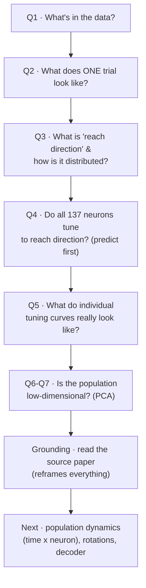
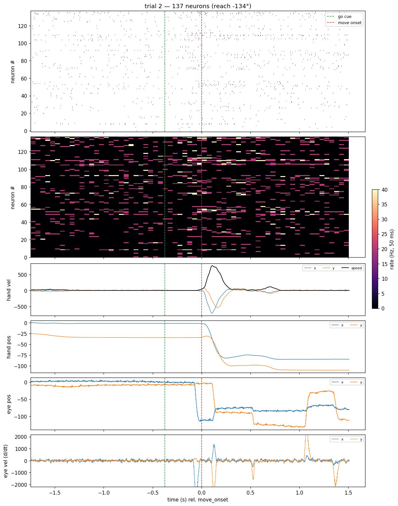
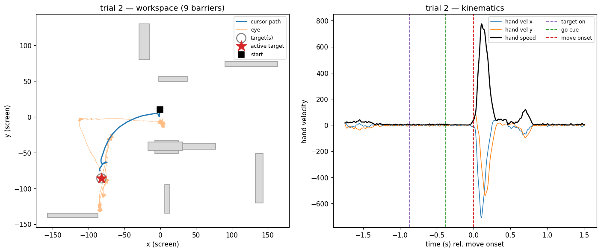
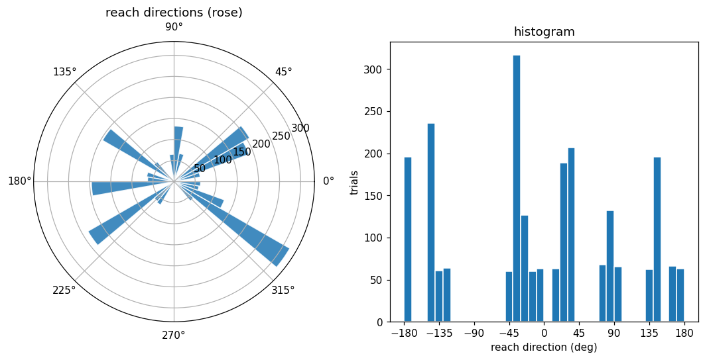
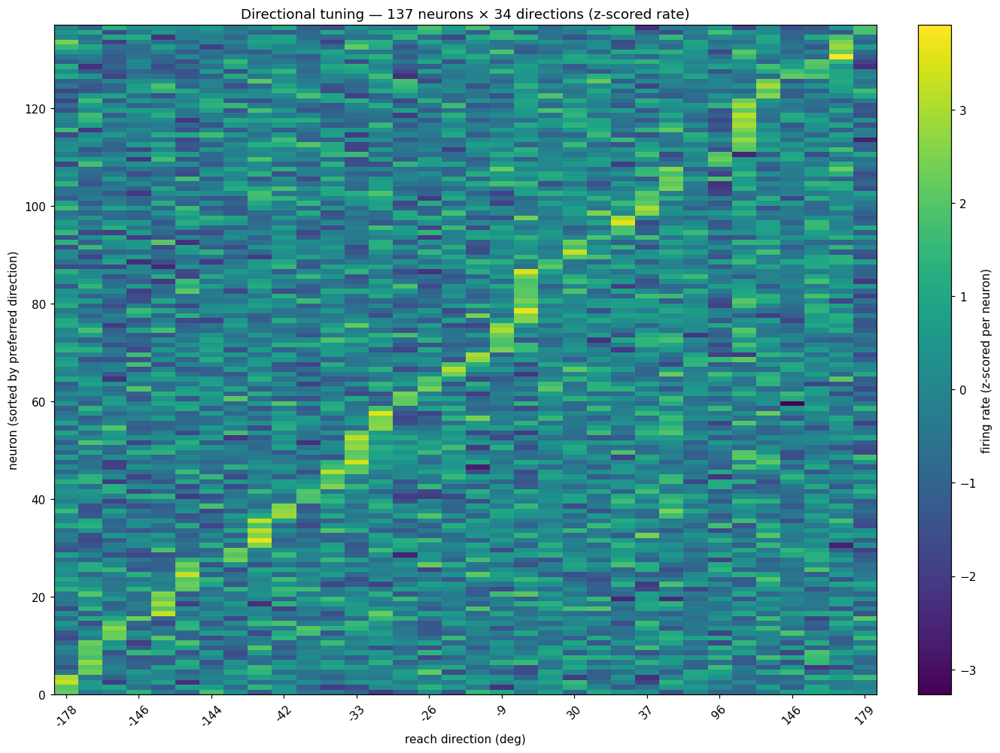
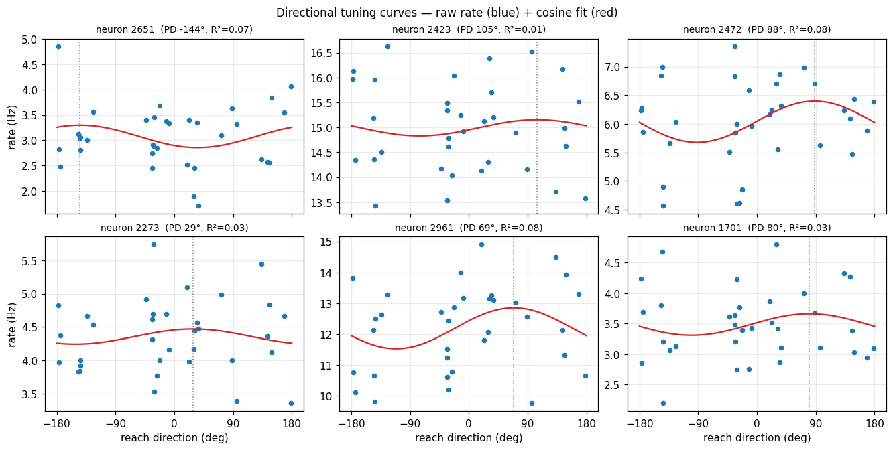
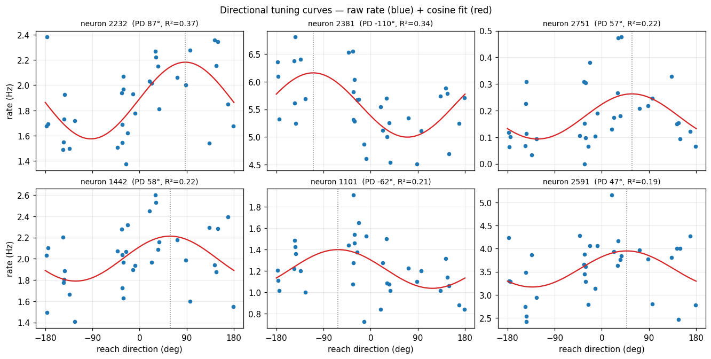

# MC_Maze Directional Tuning — Experiment Log

*Project: `motor-cortex-population-dynamics` (Season-2 capstone). Written 2026‑07‑17.*
*Repo: https://github.com/prateekkarkare/motor-cortex-population-dynamics · Notebook: `notebooks/01_load_and_explore.ipynb`*

> **What this is.** A start‑to‑finish log of the first sitting on the MC_Maze
> reaching dataset: every question we asked, *why* we asked it, what the data
> answered, and what it taught us — including which predictions held and which
> surprised us. Written so it still makes sense a year from now.

---

## TL;DR (for future‑me, 30 seconds)

- **Goal:** learn how motor cortex (M1/PMd) encodes *reach direction*, as the first
  rung toward population dimensionality‑reduction (PCA) and a reach‑direction
  **decoder**.
- **Data:** MC_Maze (Churchland & Shenoy *maze* reaches; DANDI `000128`). 137
  held‑in neurons, 2,295 trials, 1 ms spikes + hand/cursor/eye kinematics.
- **Headline finding:** neurons *are* cosine‑tuned to reach direction — **but only
  weakly** when direction is defined by the **target** (best neuron R² ≈ 0.37, most
  ≈ 0.2, vs. 0.5–0.8 in classic center‑out). 
- **Why (hypothesis):** this is a **maze** — reaches curve around barriers, so the
  *target* angle is a poor stand‑in for the *movement* the hand actually made.
- **Two craft lessons that bit us:** (1) a preferred‑direction–**sorted heatmap
  always looks diagonal**, even for noise; (2) selecting "tuned" neurons by
  **max−min rate** picks noisy high‑rate cells, not tuned ones — select by fit R².
- **The reframe (after reading the source paper):** single-neuron cosine tuning is
  *supposed* to be weak here — Churchland et al. (2010) show M1/PMd responses are
  complex/multiphasic and the real structure is **population-level dynamics**, not
  single-neuron tuning. The 2-D "ring" lives in the **time-evolving population
  trajectory (rotations)**, not the static tuning matrix. We independently walked
  into the field's tuning -> dynamics shift.
- **Next:** pivot to the **time x neuron population trajectory** — PCA the
  time-resolved state and look for **rotational (jPCA)** structure; then a decoder.

---

## 0. Setup — what we were trying to do and with what

The capstone question is a classic one from systems neuroscience: **when a monkey
reaches in a direction, how does the population of motor‑cortex neurons represent
that direction?** We chose MC_Maze because it is a large, well‑curated reaching
dataset (via the Neural Latents Benchmark) with simultaneously recorded spikes and
hand kinematics.

The raw file is one NWB (`sub‑Jenkins…train…nwb`, ~690 MB), loaded with `nlb_tools`
`NWBDataset`, which turns it into two objects: a continuous 1 ms time series
(`.data`: spikes + kinematics) and a per‑trial table (`.trial_info`: targets,
events, success). *(Environment gotchas that cost real time are in the appendix.)*

---

## The investigation, question by question

### Q1 — What is actually in this data? *(before touching any analysis)*

**Why we asked.** You can't interpret a tuning curve if you don't know what a
"trial", a "neuron", or a "direction" *is* in the file. First, orient.

**What we found.**
- `.data` at **1 ms**: `spikes` (**137 held‑in neurons**), `heldout_spikes` (45),
  plus `hand_pos`, `hand_vel`, `cursor_pos`, `eye_pos` (each x/y).
- `.trial_info`: **2,295 trials**, each with up to 3 on‑screen targets
  (`target_pos`), an `active_target` index (the one actually reached), barriers,
  and event times (`target_on`, `go_cue`, `move_onset`).

**What it taught us.**
- **Held‑out neurons** aren't a different signal — they're a *train/test split
  across neurons* for the benchmark's "co‑smoothing" task (predict the hidden
  neurons from the visible ones). We ignore them and use the 137 held‑in.
- **Binning spikes** (we used 20 ms) is just the crudest firing‑*rate* estimate:
  spike train → counts/window → Hz. Small bins = noisy/quantised; big bins =
  smooth but blurry. It's a bias–variance knob.

### Q2 — What does a single trial look like? *(raw‑data sanity check)*

**Why we asked.** Before averaging over thousands of trials, *look* at one, so any
later summary can't hide a bug or a misunderstanding.

We built a stacked, shared‑time overview — spikes, per‑neuron rates, and all
kinematics on one clock — and a 2‑D workspace view of the same trial.

**What we saw.** A textbook **delayed reach**: the hand holds still through
`target_on` → `go_cue`, then fires a single clean velocity burst ~100 ms after
`move_onset`; the cursor **curves between the barriers** to the target; the eye
saccades toward the target region around the movement.

**What it taught us (a pile of small, important truths).**
- **Coordinate frames differ.** `cursor_pos` shares the *screen* frame with the
  targets (starts at center, travels to the target). `hand_pos` is the *physical*
  manipulandum, shifted ~25 units in y. `eye_pos` roams much wider (saccades). →
  "reach direction from the hand" and "…from the target" are not trivially the
  same thing (foreshadowing Q5).
- **It is genuinely a maze:** the reach *path* is curved even when the *endpoint*
  direction is simple.
- **Derivatives amplify noise.** Eye *velocity* isn't stored; differentiating raw
  1 ms eye position is almost pure noise — we had to smooth (~20 ms) first for
  saccades to show as clean spikes. (Same reason `hand_vel` is provided
  pre‑computed.)
- **Single‑trial per‑neuron rate is quantised** (one spike in a 20 ms bin = 50 Hz),
  so a single‑trial rate "heatmap" is basically a coarse raster — you need trial
  averaging (Q4) to see smooth rates.

### Q3 — What *is* reach direction, and how is it distributed? *(defining the label)*

**Why we asked.** Directional tuning needs a direction *label* per trial. We had to
pin down its definition and reference frame, then see how the dataset samples it.

**Definition we used.** The angle of the active target from the center hold,
`θ = atan2(y_target, x_target)` in degrees (0° = +x/right, CCW positive). Because
reaches start at ~center, the target's position vector ≈ the reach vector.

**A conceptual point we surfaced.** Reach direction is *really a time series* — at
each instant the hand has a velocity vector with its own heading `θ(t) =
atan2(v_y, v_x)`. The single per‑trial angle is a **summary** of that. For a
straight reach the summary is faithful; for a **curved maze reach it is lossy**
(again foreshadowing Q5).

**What we found.** Reach direction here is **discrete**: only **~35 unique target
positions / 34 unique angles** across 2,295 trials — and the sampling is
**non‑uniform**, with genuine **gaps** (e.g. nothing at ~−90° straight down). But
every direction that *exists* is **well sampled** (52–129 trials each, median 63).

**What it taught us.** Treat direction as a **categorical variable with ~34
levels**, not a continuous sweep. The gaps aren't under‑sampling — they mean *no
target exists at that angle*. Good statistics per direction; uneven angular
coverage; not a clean 8‑way center‑out.

### Q4 — Do the 137 neurons tune to reach direction? *(prediction first!)*

**Why we asked.** This is the capstone's core question, and the point where the
learning value is in **predicting before looking**.

> **Prediction (written before the plot):** a **cosine / Gaussian bump** peaking at
> each neuron's preferred direction; **most** of the 137 tuned, with a few flat;
> preferred directions **non‑uniform**. *Motivation: characterise each neuron by
> direction so similar neurons can be grouped.*

We averaged each neuron's firing rate (in a −100…+400 ms peri‑movement window) over
trials at each of the 34 directions → a **34 × 137** tuning matrix, then drew it as
a heatmap: each neuron **z‑scored** across directions (so tuning *shape* shows
regardless of baseline rate), neurons **sorted by preferred direction**.

**What it looked like.** A gorgeous, clean **diagonal band** — every direction is
some neuron's favourite, with a dark anti‑preferred trough ~180° opposite. It looks
like a poster‑perfect population code.

**The caveat we immediately flagged (and it mattered).** *Sorting neurons by their
argmax preferred direction produces a diagonal even from pure noise.* The diagonal
alone proves nothing; only the **contrast** of the band and the anti‑preferred
trough hint at real tuning. To actually trust it, look at raw single‑neuron curves
— Q5.

### Q5 — What do individual tuning curves really look like? *(and the twist)*

**Why we asked.** To check whether the beautiful heatmap was real tuning or a
sorting artifact, and to finally *see* the predicted cosine bump in raw Hz.

**First attempt — and a self‑inflicted lesson.** We first picked "tuned" neurons by
**modulation depth** (max − min rate). The curves came out **flat / noise‑cloud**,
cosine R² ≈ **0.01–0.08**:

→ **Lesson:** max−min depth just favours **high‑rate, noisy** neurons, not *tuned*
ones. A big spread of rates ≠ directional tuning. Select by the **cosine fit R²**
instead.

**Second attempt — select the best cosine fits.** Now the bumps appear, but they're
**modest**: best neuron **R² ≈ 0.37**, most ≈ **0.2**; preferred directions differ
across neurons (e.g. neuron 2232 peaks ~+87°, neuron 2381 ~−110°).

**The surprise.** The population heatmap *looked* like crisp tuning, but individual
neurons are only **weakly** cosine‑tuned **to the target direction** — much weaker
than the textbook center‑out result. The heatmap oversold it (the sort), exactly as
the Q4 caveat warned.

**Why (leading hypothesis).** The **maze**. Because reaches curve around barriers,
trials sent to the "same" target angle involve **different actual movements**;
averaging them blurs the cosine. Motor cortex is thought to encode the **movement**
(hand velocity), not the abstract goal — so *target* angle is the wrong label. This
is the very target‑vs‑movement distinction we noticed back in Q2/Q3.

### Q6-Q7 — Is the population low-dimensional? *(PCA)*

**Why we asked.** If 137 neurons are really reading out a few latent signals, PCA
should show it. Pure cosine tuning predicts the *direction* signal is **2-D** (the
cos/sin of the angle), so the 34 conditions in PC1-PC2 should trace a **ring**.

**What we found (surprise).** They didn't. PCA of the trial-averaged 34x137 tuning
matrix took **~17 PCs to reach 85%** (PC1 22%, PC2 10%); PC1-PC2 was a **scrambled
blob, not a ring**, and PC1/PC2 vs angle were jagged, not cos/sin. Robustness checks:
- **z-scoring** each neuron (equal vote) made it *worse* (85% at ~21 PCs) -> the
  high dimensionality is real, not a loud-neuron artifact.
- **straight reaches only** (tortuosity <= 1.18) stayed high-D, but with only 3-11
  trials/direction -> noise-dominated and inconclusive.

**Lesson (craft).** Removing the maze confound by *subsetting* traded bias for
variance (too few trials -> noise). Better to relabel/model than subset. (Full PCA
in notebook section 7.)

---

## Predictions vs. outcomes

| # | Prediction (before plotting) | Outcome | Verdict |
|---|------------------------------|---------|---------|
| 1 | Firing rate vs direction = **cosine/Gaussian bump** at a preferred direction | True in shape — best fits are clearly cosine — but **weak** (R² ≈ 0.2–0.37) to *target* direction | **Met, with an asterisk** |
| 2 | **Most** of 137 tuned; a few flat | Best cells clearly tuned; *many* are weak/noisy **to target direction** — more "flat" than expected | **Partly met** |
| 3 | Preferred directions **non‑uniform** | Not yet tested — the sorted heatmap can't show it; needs a preferred‑direction histogram | **Open** |
| — | *(surprise)* Heatmap looked cleanly tuned | Single‑neuron tuning to target direction is modest; the diagonal was partly a **sorting artifact** | **Unexpected** |

---

## What we learned

**Neuroscience / data.**
- M1/PMd neurons carry a **cosine directional signal**, but its strength depends
  entirely on *how you define direction*. In a maze, **target ≠ movement**, and
  tuning to the target is weak.
- Reach direction is fundamentally a **velocity time series**; a per‑trial scalar is
  a lossy summary that's fine for straight reaches and poor for curved ones.

**Method / craft (the transferable stuff).**
- **Predict before you plot.** The value was in calling the cosine shape *first*,
  then being genuinely surprised by its weakness.
- **A sorted heatmap always looks structured.** Sorting by argmax manufactures a
  diagonal from noise; trust **contrast + independent raw curves**, not the sort.
- **Choose selection metrics that match the question.** "Most variable" (max−min) is
  not "most tuned" (fit R²). The wrong metric nearly hid the real result.
- **z‑scoring** reveals *shape* by removing baseline and depth — great for comparing
  tuning across neurons, but it *hides* absolute rate and tuning *strength*; always
  cross‑check with raw units.
- **Look at one trial before averaging thousands.** Half our "gotchas" (frames,
  barrier encoding, eye‑velocity noise, rate quantisation) came from Q2.

---

## Grounding (the step we should have taken first): the source paper

After all of the above we stepped back and read the paper behind the data —
**Churchland, Cunningham, Kaufman, Ryu & Shenoy (2010), "Cortical preparatory
activity: representation of movement or first cog in a dynamical machine?"**,
*Neuron* 68(3):387-400 (PMC2991102). It reframes everything.

### What the experiment actually is
- **Task:** a **delayed reach**. The monkey holds a central spot; a **target**
  appears; after a variable **delay** a **go cue** is given; then it reaches. Only
  delays > 400 ms are analysed. Reaches last ~200-600 ms.
- **Ours is the "maze task," monkey J (Jenkins)** — hence `sub-Jenkins`. Central
  start -> **one** target + **virtual barriers**; the reach is **straight** (no
  barrier) or must **curve** around barriers. Some conditions add **distractor**
  targets.
- **Recordings — our exact dataset is the "monkey J-array" set:** a pair of
  implanted **96-electrode arrays** in **caudal PMd + surface/sulcal M1** (so our
  137 units are a **mix of M1 and PMd**), **~2,155 trials/neuron**, **~108
  conditions**.
- **Why so many weak neurons:** arrays record **unbiased** (often multi-unit, lower
  modulation) — unlike hand-placed single electrodes that *select* strongly-tuned
  cells. The messy, weakly-tuned population we saw is the honest one.
- **Conditions vs directions:** ~108 conditions but only ~35 target locations, so the
  **same direction is reached by several different movements** (straight vs curved).
  The target-vs-movement decoupling we kept hitting is **designed into the task.**

### Our "failures" are the paper's headline findings
| What we found | What the paper reports |
|---|---|
| Cosine tuning weak (R^2 ~ 0.2-0.37) | Single-neuron responses **"complex and multiphasic," "not easily explained by a pure directional preference"** — even for straight reaches |
| PCA needs ~17-21 dims (no 2-D ring) | Population is high-D: preparation **"at least 7-10 dimensions,"** movement PCA uses **k = 3-14** |
| Straight-reach subset didn't rescue a ring | Complexity is present **even for simple center-out reaches** — subsetting was never going to give a ring |
| Direction wasn't the dominant PC | No task variable (endpoint/velocity/direction/...) beat the **population's own activity space**; *"underscores our ignorance regarding the true factors"* |

We independently walked into the exact wall that pushed the field from **tuning
curves -> population dynamics**.

### Where the 2-D "ring" actually lives
The cosine -> 2-D intuition was **right about the wrong object.** In the paper's
harmonic-oscillator model (their Fig. 8), the **population** traces **rotations**
through state space **over time**; a single neuron then looks like a messy cos/sin
mixture only weakly tied to preparation. The 2-D structure is **rotational dynamics
of the population trajectory in time** — not a static tuning curve. We were PCA-ing
the **static condition x neuron** matrix; the structure is in the **time x neuron
trajectory.**

---

## Appendix — environment & reproducibility (the plumbing)

Real time went into making `nlb_tools` run on a modern Mac; recording so it never
bites again:

- **`nlb_tools` pins `pandas <= 1.3.4`**, which has *no* Apple‑Silicon wheel → pip
  tries to build it from source and fails. Fix: **Python 3.9** venv + **`pandas
  1.5.3`** + install `nlb_tools` with `--no-deps`.
- On pandas ≥ 1.5, `nlb_tools`' `resample()` and `make_trial_data()` break (strict
  index‑frequency validation). Fix: after binning, **rebuild a clean regular
  `TimedeltaIndex`** (`bin_spikes` does this).
- **Slicing a trial** with `.loc[start:end]` on the native 1 ms index silently
  returns the *whole* session → use a boolean time **mask** (`trial_window`).
- **`dandi` CLI is version‑blocked** (server needs ≥ 0.74, which dropped Py3.9) →
  download the two NWB assets **directly from the DANDI API** with `curl`.
- Data is git‑ignored (~690 MB); see the repo README for the exact download step.

---

## Next steps

The reframe changes the plan: stop chasing single-neuron *direction tuning* (the
source paper shows it's the wrong frame here) and move to **population dynamics**.

1. **Time x neuron population trajectory.** Build trial-averaged PSTHs per condition,
   stack into a (time x neuron) matrix, PCA it, and plot the **state-space
   trajectory** aligned to movement onset. This is the object the paper analyses.
2. **Look for rotational structure (jPCA).** The 2-D cos/sin we expected should show
   up as **rotations** of the population state over time, not a static ring
   (Churchland et al. 2012 Nature, *Neural population dynamics during reaching*).
3. **Condition-independent signal first.** Expect PC1 to be the big shared
   movement-onset ramp (not direction) — separate it out before reading direction.
4. **Only then a decoder:** reconstruct hand velocity `v(t)` from the low-D
   population state over time (the season goal).

Older threads still worth a look, but secondary: hand-velocity-based direction
labels, a preferred-direction histogram, and clustering neurons by tuning.

*— end of log —*
